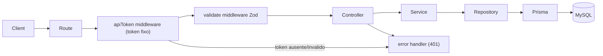

# API de Cadastro de Máquinas

## Objetivo
API REST modular para cadastrar máquinas (UUID gerado pelo client) e listar as cadastradas (UUID + data/hora de registro), documentada com Swagger.

## Stack
- Runtime: Node + TypeScript + Express
- Persistência: MySQL via Prisma (ORM + migrations)
- Validação: Zod
- Docs: `swagger-ui-express` + `swagger-jsdoc` (OpenAPI 3)
- Qualidade: ESLint + Prettier
- Dev: `tsx` (hot reload) e `dotenv` para config

## Arquitetura em camadas
Separação de responsabilidades por módulo (`machines`), cada camada com papel único:

- `routes` -> declara endpoints e aplica middlewares (auth + validação)
- `controller` -> lida com req/res, delega para o service, não contém regra de negócio
- `service` -> regra de negócio (ex.: checar UUID duplicado)
- `repository` -> acesso a dados via Prisma (única camada que conhece o banco)

Fluxo de uma requisição (POST protegido por token fixo):



## Estrutura de pastas
```
prisma/
  schema.prisma
src/
  config/
    env.ts            # carrega/valida variáveis de ambiente
    swagger.ts        # definição base OpenAPI + setup
  lib/
    prisma.ts         # singleton do PrismaClient
  middlewares/
    api-token.ts      # autenticacao por token fixo (POST de cadastro)
    validate.ts       # valida body/params com schema Zod
    error-handler.ts  # tratamento centralizado de erros
  modules/
    machines/
      machine.routes.ts
      machine.controller.ts
      machine.service.ts
      machine.repository.ts
      machine.schema.ts   # schemas Zod (input)
  app.ts              # cria app Express, monta middlewares e rotas
  server.ts           # bootstrap (listen na porta)
.env.example
.eslintrc / eslint.config.js
.prettierrc
tsconfig.json
package.json
```

## Modelo de dados (Prisma)
A máquina usa o UUID enviado pelo client como chave primária e registra o timestamp automaticamente:

```prisma
model Machine {
  id        String   @id @db.Char(36)   // UUID gerado pelo client
  createdAt DateTime @default(now())
}
```

## Endpoints
- `POST /api/machines` (protegido por token fixo)
  - Auth: header `Authorization: Bearer <API_TOKEN>` validado pelo middleware `api-token`
  - Body: `{ "id": "<uuid v4>" }` (validado como UUID via Zod)
  - Regra: rejeita UUID duplicado (409 Conflict)
  - Respostas: `201 Created`, `400` (UUID inválido), `401` (token ausente/inválido), `409` (já existe)
- `GET /api/machines` (público por enquanto)
  - Lista máquinas retornando `{ "id": "<uuid>", "createdAt": "<ISO datetime>" }`
  - Resposta: `200 OK`
  - Futuro: passará a exigir autenticação por login (sessão/JWT) — fora do escopo atual
- `GET /docs` -> Swagger UI

## Autenticação (token fixo no cadastro)
- Token único configurado em `API_TOKEN` (env), compartilhado com o client.
- Middleware `api-token.ts` lê o header `Authorization: Bearer <token>` (ou `x-api-token`) e compara com `API_TOKEN`; se ausente/divergente, lança erro tratado como `401`.
- Aplicado apenas na rota de cadastro; a listagem permanece aberta até a implementação do login.
- Documentado no Swagger como `securityScheme` do tipo `http bearer`, aplicado somente ao `POST`.

## Tratamento de erros e respostas
- Middleware `error-handler` centraliza erros e padroniza payload `{ error: { message, code } }`.
- Erros de validação do Zod -> `400`; conflito de UUID -> `409`.

## Configuração
- `.env` com `DATABASE_URL` (MySQL), `PORT` e `API_TOKEN` (token fixo do cadastro).
- `env.ts` valida presença das variáveis no boot.

## Fases de implementação
Cada fase é incremental e termina em um estado verificável.

### Fase 1 — Fundação do projeto
- Inicializar `package.json`, `tsconfig.json` e instalar deps/devDeps.
- Configurar ESLint + Prettier e scripts npm (`dev`, `build`, `start`, `lint`, `prisma`).
- Entregável: projeto compila (`npm run build`) e lint roda sem erros.

### Fase 2 — Camada de dados (Prisma + MySQL)
- Criar `prisma/schema.prisma` com o model `Machine` (id `Char(36)` PK, `createdAt`).
- Configurar `.env.example`, gerar client e criar singleton em `src/lib/prisma.ts`.
- Rodar primeira migration.
- Entregável: client Prisma gerado e tabela criada no MySQL.

### Fase 3 — Núcleo HTTP
- `config/env.ts` (validação das variáveis incl. `API_TOKEN`), `app.ts`, `server.ts`.
- Middlewares `error-handler.ts` e `validate.ts`.
- Endpoint de health check simples para validar o boot.
- Entregável: servidor sobe e responde a uma rota básica.

### Fase 4 — Módulo Machines
- Implementar em camadas: `machine.schema.ts` (Zod), `machine.repository.ts`, `machine.service.ts` (checagem de duplicado), `machine.controller.ts`, `machine.routes.ts`.
- Entregável: `POST` e `GET /api/machines` funcionando (ainda sem auth no POST).

### Fase 5 — Autenticação por token fixo
- Middleware `api-token.ts` e aplicação na rota `POST /api/machines` (401 quando inválido).
- Entregável: cadastro exige token; listagem permanece aberta.

### Fase 6 — Documentação Swagger
- `config/swagger.ts` (definição OpenAPI + `securityScheme` bearer) e anotações nos endpoints.
- Expor Swagger UI em `/docs`.
- Entregável: `/docs` navegável e cadastro testável com token pela UI.

## Observação sobre nomes
- Campo do UUID será `id` no corpo/JSON (chave primária). Se preferir `codigo`, ajustamos o schema e o mapeamento sem impacto na arquitetura.